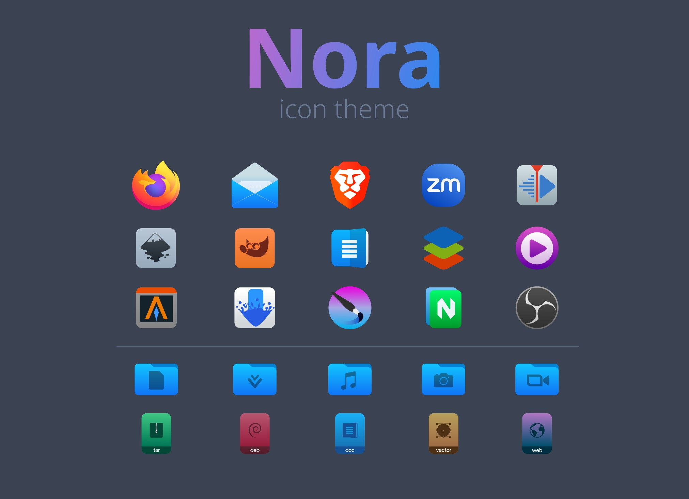

# NORA

**Nora** is an SVG icon theme for GNU/Linux operating systems forked from **Kora**, replacing/modifying a few icons, especially mimetype icons and some application icons. The differences can be clearly seen in the preview.

Unlike Kora, which has many versions, Nora has only one version for now though different versions might be developed in the future.

## Installation

Clone this repository on your system

    git clone https://github.com/vaan-linux/Nora.git

and copy ***Nora*** directory to one of the following directorys:

* `/usr/share/icons/` - icons available system-wide
* `$HOME/.local/share/icons/` - icons only available to local user

## Preview

## License

[GPL3](https://www.gnu.org/licenses/gpl-3.0-standalone.html)
